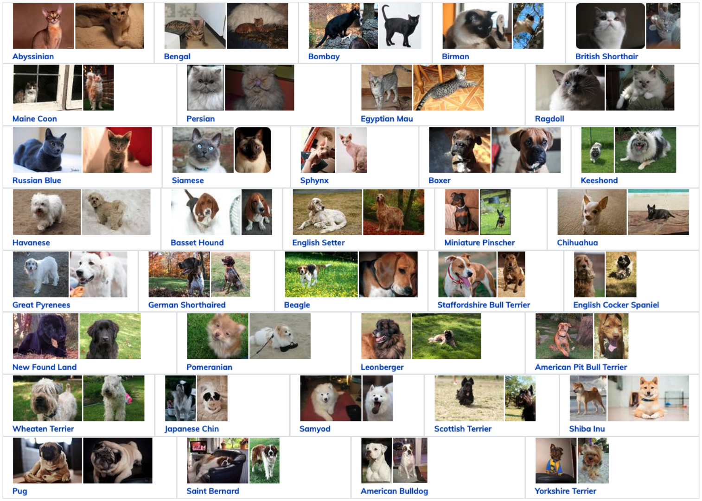

# Pet Classification with CNN
<b>Student</b>: Lorenzo Severini<b>&emsp;&emsp;&emsp;&emsp;&emsp;&emsp;Course</b>: Computer Vision and Image Processing M

# Project Overview
The goal of this project is to implement a neural network that classifies images of 37 breeds of cats
and dogs from the Oxford-IIIT-Pet dataset. The project is divided into two tasks: first, you will be
asked to implement from scratch your own neural network for image classification; then, you will
fine-tune a pre-trained network provided by Keras.

## Dataset
### Overview
The dataset you will be using contains images of pets.

You can download the dataset at the following URL: https://www.robots.ox.ac.uk/~vgg/data/pets/.

### Content
The repository contains a 37-category pet dataset with roughly 200 images for each class. The
images have a large variation in scale, pose and lighting. All images have an associated ground
truth annotation of breed. The dataset is already split into training, validation and testing. You
should use only the training and validation splits for development in both the first and second tasks.

## First Task: design your own network
The goal is to implement a convolutional neural network for image classification and train it on
the <code>Oxford-IIIT-Pet Dataset</code>. You should consider yourself satisfied once you obtain a classification
accuracy on the validation split of around 60%. You are free to achieve that however you want,
except for a few rules you must follow:
<ul>
<li>You cannot simply instantiate an off-the-shelf Keras network. Instead, you must construct
your network as a composition of existing Keras layers;</li>
<li>Justify every design choice you make. Design choices include network architecture, training
hyperparameters, and, possibly, dataset preprocessing steps. You can either (i) start from
the simplest convolutional network you can think of and add complexity one step at a time,
while showing how each step gets you closer to the target 60%, or (ii) start from a model
that is already able to achieve the desired accuracy and show how, by removing some of its
components, its performance changes. You can show your results however you want: training
plots, console-printed values or tables.</li>
</ul>
Don’t be too concerned with your network performance: the 60% is just to give you an idea of
when to stop.

## Second Task: fine-tune an existing network

Your goal is to fine-tune a pre-trained ResNet-18 model on the Oxford-IIIT-Pet Dataset. Use the
implementation provided by Keras; do not implement it yourselves (i.e. exactly what you could
not do in the first task). Specifically, you must use the Keras ResNet-18 model pre-trained on
ImageNet-1K.

Divide your fine-tuning into two parts:
<ol>
<li>First, fine-tune the ResNet-18 with the same training hyperparameters you used for your best
model in the first task of the project;</li>
<li>Then, tweak the training hyperparameters in order to increase the accuracy on the validation
split of the Oxford-IIIT-Pet Dataset. Justify your choices by analysing the training plots
and/or citing sources that guided you in your decisions (papers, blog posts, YouTube videos,
or whatever else you find enlightening). You should consider yourself satisfied once you obtain
a classification accuracy on the validation split between 80 and 90%.</li>
</ol>

## Final Task: assess the performance on the testing set
Assess the performance of your best model from both tasks on the testing set as the final evaluation.
